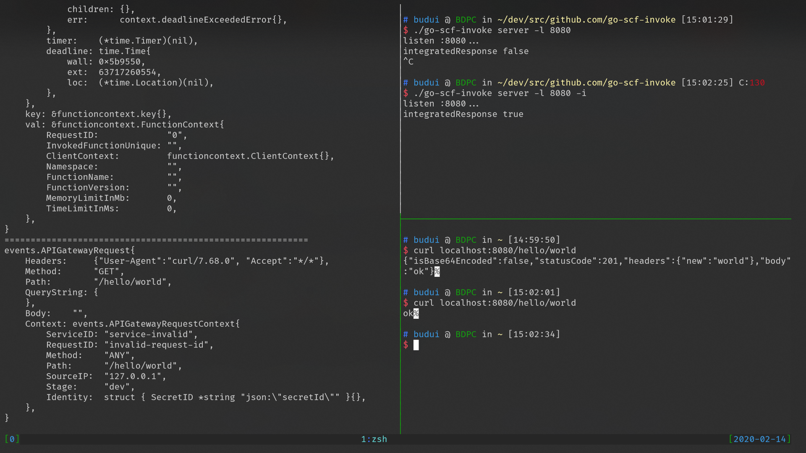

# go-scf-invoke

本地测试腾讯云云函数，支持直接使用JSON文件发送请求或者转发本地HTTP请求。

## 缘由

腾讯云的VScode插件暂时不支持golang，为了本地测试，编写了这个小工具。本工具思路来自于[Running Go AWS Lambda functions locally](https://djhworld.github.io/post/2018/01/27/running-go-aws-lambda-functions-locally/)，核心代码抄袭自[go-lambda-invoke](https://github.com/djhworld/go-lambda-invoke)。我做了一些适配腾讯云、HTTP请求转换为API网关事件的微小工作。

## 安装

`go install wrong.wang/x/go-scf-invoke`

## 使用

### 转发HTTP请求

用来模拟API网关

```bash
# 1. run scf
$ _LAMBDA_SERVER_PORT=8001 ./index
# 2. run go-scf-invoke
$ go-scf-invoke server
# 3. now, visit localhost:8080, scf will recive your request.
```



### 提交本地JSON文件作为事件

请自备模拟JSON文件，用来模拟COS事件、定时器事件等等。

```bash
# 1. run scf
$ _LAMBDA_SERVER_PORT=8001 ./index
# 2. run go-scf-invoke
$ go-scf-invoke json -path "/path/to/input.json"
```
